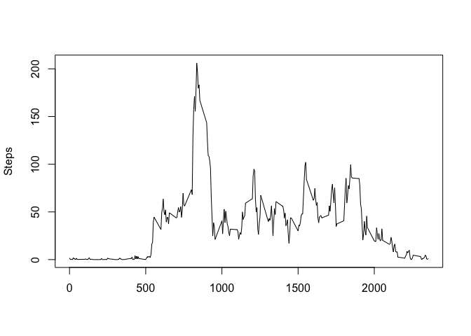
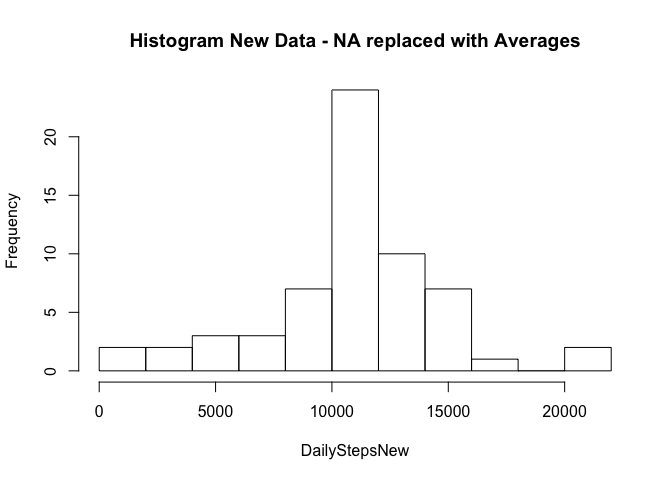
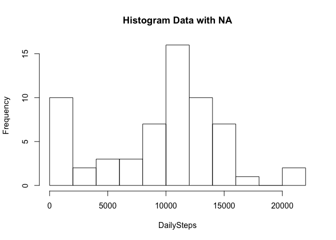
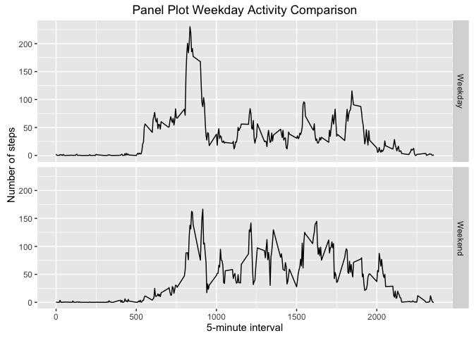

# Reproducible Research Week 2 Assignment
Anglom  
03 July 2016  

The data used in this assignment is a collection of personal movement data collected through activity monitoring devices such as Fitbit, Nike Fuelband and Jawbone Up. The devices collected data at 5 minute intervals through out the day.  The number of steps taken over two months namely October and November 2012 will be analysed in this report.

##Loading and preprocessing the data

The data can be loaded with the following R code:

```r
#unzip("repdata%2Fdata%2Factivity.zip")
dataActivity<-read.csv("activity.csv", stringsAsFactors = FALSE)

#Converting date field to class date
dataActivity$date<-as.Date(dataActivity$date)

#Converting fields steps and interval to numeric
dataActivity$steps<-as.numeric(dataActivity$steps)
dataActivity$interval<-as.numeric(dataActivity$interval)
```

The data is made up of three variables steps, date and interval.

##What is mean total number of steps taken per day?

The mean total number of steps taken per day is found using the following code:

```r
DailySteps <- tapply(dataActivity$steps, dataActivity$date, FUN=sum, na.rm=TRUE)

MeanSteps<-round(mean(DailySteps,na.rm=TRUE), 0)
```

The mean number of steps was found to be equal to 9354.

##What is the average daily activity pattern?

To analyse the average daily activity pattern we should create a plot with the intervals in the x axis and the average steps over all days in the y axis.


```r
Averages <- aggregate(x=list(steps=dataActivity$steps), by=list(interval=dataActivity$interval), FUN=mean, na.rm=TRUE)
plot(Averages , type="l", xlab="", ylab="Steps",col="black")  
```

<!-- -->

We can see the time interval with the maximum observed average activity is: 

```
## [1] 835
```

##Inputing missing values
The data contains numerous NA entries which could be having a large impact on the analysis.  

To investigate how many NA values are included run the following R code:

```r
sum(is.na(dataActivity$steps))
```

```
## [1] 2304
```

Creating a new dataset, replacing NAs with the calculated interval average calculated earlier.

```r
newData<-dataActivity

for(i in 1:nrow(newData)){
  if (is.na(newData$steps[i])) {
    newData$steps[i]<-Averages[Averages[1]==newData$interval[i],2]
  }
}
```

Computing the mean and the median on the new dataset

```r
DailyStepsNew <- tapply(newData$steps, newData$date, FUN=sum)
MeanStepsNew<-round(mean(DailyStepsNew),0)
MedianSteps<-round(median(DailyStepsNew),0)
```

The new mean number of daily steps was found to be 10766 which is higher than the previously calculated 9354 where the missing values were simply ignored. 

The median number of daily steps of the new data set was found to be equivalent to the new mean 10766.

Creating a histogram.  By comparing the histograms of the original data with the new averaged data replacement for missing values we can see that we corrected for a misleading high level of 0 daily steps which was a result of missing readings rather than a correct representation of the persons activity.

```r
hist(DailyStepsNew,breaks=10,main = "Histogram New Data - NA replaced with Averages")
```

<!-- -->

```r
hist(DailySteps,breaks=10, main="Histogram Data with NA")
```

<!-- -->
  
##Are there differences in activity patterns between weekdays and weekends?

We first need to create a variable which will label dates as weekends or weekdays.


```r
newData$weekday<-weekdays(newData$date)
for(i in 1:nrow(newData)){
  if (newData$weekday[i] %in% c("Monday","Tuesday","Wednesday","Thursday","Friday"))
    newData$weekday[i]<-"Weekday"
  else 
    newData$weekday[i]<-"Weekend"
}
newData$weekday<-as.factor(newData$weekday)
```

We will now create a panel plot to analyse the differences between weekend and weekday activity.


```r
library(ggplot2)
Averages <- aggregate(steps ~ weekday+interval, data=newData, mean)
ggplot(Averages, aes(interval, steps)) + geom_line() + xlab("5-minute interval") + ylab("Number of steps")+ggtitle("Panel Plot Weekday Activity Comparison")+facet_grid(weekday~.)
```

<!-- -->
  
From the charts we can see that the overall daily steps are higher on weekends, however during the peak time interval weekdays tend to have a higher peak than weekends this is probably reflective of the daily commute to the office during weekdays and an overall less sedentary activity pattern over all time periods during the weekends.
